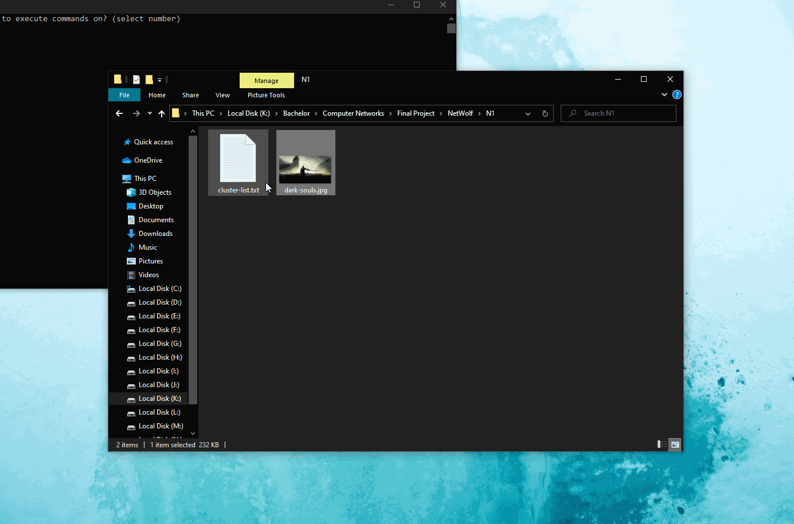

NetWolf is a P2P torrent-like network application written in Python for the final project of my Computer Networks Course with the following capabilities:
* Discovering clusters and maintaining a cluster list at each node by periodically sending a UDP customized DISCOVERY message
* Sharing files between nodes by sending a UDP customized GET message (which includes the file names), waiting for the answer, and selecting the best node (fastest response), and then establishing a TCP connection for transmitting the file

Application in action: (Click to open in full size on a new tab)

