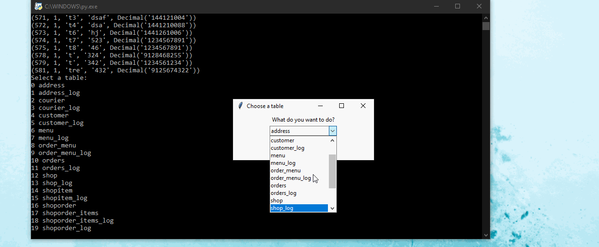

- A database system for restaurant management using Python, Tkinter library, and MySQL for the final
project of my Database Design course
- Applied ER and normalization techniques to design the database and adopted Python to build
a GUI app to connect with the database and add/delete/edit records and tables, and execute
queries on the database

Application in action: (Click to open in full size on a new tab)

